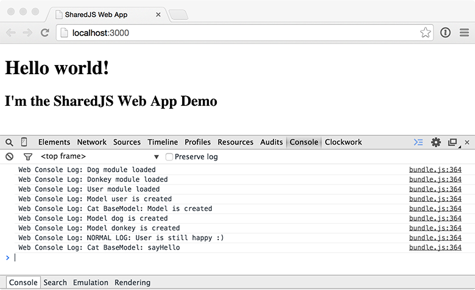

# SharedJS Web App
CommonJS Browserify HTML5 webbrowser client.
	
###Setup insctructions
Apart from the npm dependencies, this project has a dependancy on the [SharedJS.Core](https://github.com/karaoak/SharedJS.Core) shared JS codebase project to be symlinked inside the app/lib/core directory of this project.

So setting up this project would require the following:

	$ npm install
	$ cd app/src
	$ ln -s [sharedjs-core]/src core (typically: $ ln -s ../../../core/src core)
	
###Build instructions
Use the repository grunt build task to run this demo web app.
You should see something as the below output in the console. Please look at the code on how and from where these log lines come.

### Documentation
Please find a list of the main libraries and modules used in this project:

* [CommonJS](http://wiki.commonjs.org/wiki/CommonJS)
* [Browserify](http://browserify.org/)
* [Remapify](https://github.com/joeybaker/remapify)

For more information see my slides on [Speakerdeck](https://speakerdeck.com/karaoak/shared-web-plus-ti-app-javascript-codebase)

	

	
	
